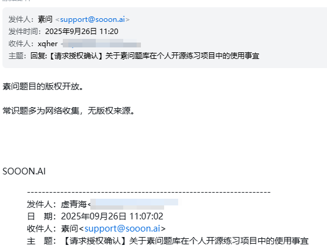

# 素问抢答对战模拟器

本站为素问的抢答对战模拟器，旨在提供一个供用户随时进行抢答对战练习的工具。

## 项目代码授权 (License for Code)

本项目的代码部分遵循 **MIT License**。详情请见 `LICENSE` 文件。

---

## 内容授权与来源说明 (Content License and Source)

**重要提示**：本项目包含的题库数据**不**适用 MIT 协议。它们由不同来源构成，具体授权如下：

> 根据题库中的 type 字段区分，type 为 sooon_ai 的题目为素问题目，type 为 common_sense 的题目为常识题目。
>
> 当前（2025-09-26）存量爬取的 1485 题为 AI 预筛后手动分类，可能存在误判错漏，欢迎通过 Github issue 反馈。

### 1. “素问题目” 

*   **来源**: [素问](https://sooon.ai/)，并附上原始链接。
*   **授权**: 原作者已声明“版权开放”。此处将其视为 **公共领域 (Public Domain) / CC0** 内容处理，并对原作者的无私贡献表示衷心感谢。您可以自由地复制、修改、分发和使用这些题目，甚至用于商业目的，都无需请求许可。

> 参见 [素问维护者在读者须知](https://www.zhihu.com/question/264373660/answer/1710187984#:~:text=%E6%88%91%E5%86%99%E7%9A%84%E4%B8%9C%E8%A5%BF%E9%83%BD%E5%8F%AF%E4%BB%A5%E9%9A%8F%E4%BE%BF%E5%85%8D%E8%B4%B9%E8%BD%AC%E8%BD%BD%EF%BC%8C%E4%B8%8D%E7%94%A8%E9%97%AE%E6%88%91%EF%BC%8C%E4%B8%8D%E7%94%A8%E6%B3%A8%E6%98%8E%E5%87%BA%E5%A4%84%E3%80%81%E4%B8%8D%E9%9C%80%E8%A6%81%E5%A3%B0%E6%98%8E%E5%8E%9F%E8%91%97%E4%BD%9C%E6%9D%83%E3%80%81%E4%B8%8D%E7%94%A8%E7%BB%99%E9%92%B1%EF%BC%8C%E4%BD%A0%E8%B5%9A%E4%BA%86%E9%92%B1%E7%9A%84%E8%AF%9D%E9%83%BD%E5%BD%92%E4%BD%A0%E8%87%AA%E5%B7%B1%E3%80%82)中的说明。

*   **归属**: 虽然协议允许，但我们强烈建议您在使用时保留对原作者 [素问](https://sooon.ai/) 的署名。

### 2. “常识题目” 

*   **!!! 重要风险提示 !!!**
*   **来源**: 此部分内容由原作者从网络各处收集整理，其**原始版权来源不明**。
*   **授权**: **无授权**。原作者仅为收集者，不持有版权，也无法对您进行授权。
*   **使用风险**: 这部分内容**可能包含受版权保护的材料**。您在使用、复制或分发这部分数据时，需自行承担所有潜在的法律风险。本项目及其贡献者不对因使用此数据而产生的任何版权纠纷负责。
*   **建议**: 仅建议用于个人学习和非商业性研究。在任何正式或商业项目中使用前，请务必自行进行版权尽职调查。